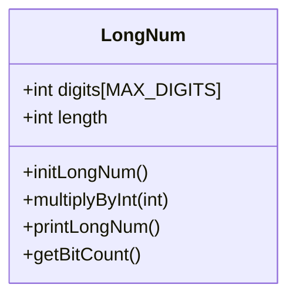
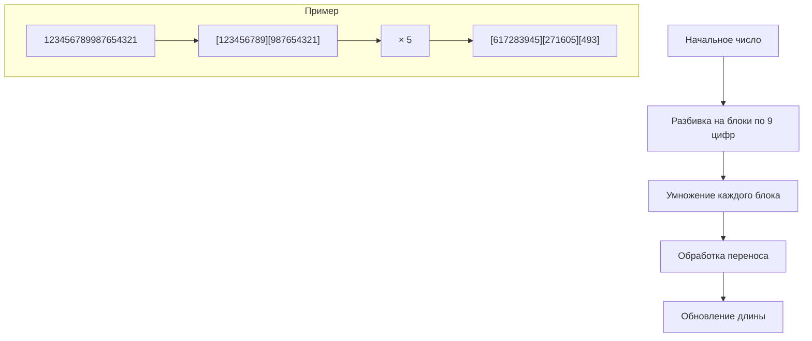
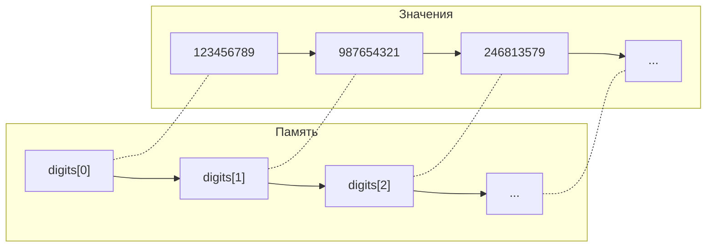

# Длинная арифметика на C

Давайте разберу, как это работает.

### Структура данных

Большие числа хранятся в структуре:

```c
typedef struct {
    int digits[MAX_DIGITS];  // массив для хранения цифр числа
    int length;              // текущая длина числа
} LongNum;
```

Вот схема, как это выглядит в памяти:

```
┌────────────┬────────────┬────────────┬────────┐
│  digits[0] │  digits[1] │  digits[2] │   ...  │
├────────────┼────────────┼────────────┼────────┤
│ 123456789  │ 987654321  │ 246813579  │   ...  │
└────────────┴────────────┴────────────┴────────┘
     ▲            ▲            ▲
  9 цифр       9 цифр      9 цифр
```

Каждая ячейка хранит 9 цифр числа (BASE = 10^9). Это позволяет эффективно использовать память и избежать переполнения при умножении.

### Визуализация структуры данных



### Процесс умножения



### Организация памяти



## Как юзать?

1. Клонируйте репозиторий:
```bash
git clone https://github.com/your-username/long-arithmetic
```

2. Соберите проект:
```bash
make
```

3. Запустите:
```bash
./factorial
```

4. Введите число для подсчета факториала. Программа будет показывать:
   - Текущий результат
   - Сколько бит занимает число
   - Когда результат превысит размеры char, short, int и long long

## Особенности реализации 🛠

- Поддерживает числа до 10^900000
- Эффективное использование памяти (9 цифр на один int)
- Показывает прогресс вычисления
- Автоматическое отслеживание переполнения типов данных

## Технические детали 

```c
#define BASE 1000000000  // 10^9
#define MAX_DIGITS 100000
```

- BASE: максимальное значение в одной ячейке
- MAX_DIGITS: максимальное количество блоков по 9 цифр
- Максимальное поддерживаемое число: примерно 10^900000

## Ограничения ⚠️

- Только положительные целые числа
- Максимальный множитель: INT_MAX
- Требуется (MAX_DIGITS × 4) байт памяти для одного числа

## Может быть, но маловероятно

- [ ] Добавить отрицательные числа
- [ ] Реализовать деление
- [ ] Добавить сложение и вычитание
- [ ] Оптимизировать память (динамическое выделение)
- [ ] Добавить тесты производительности
