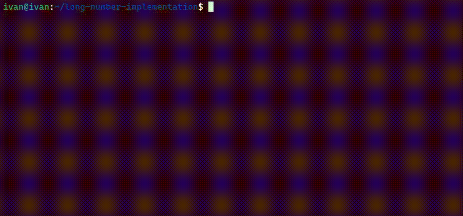
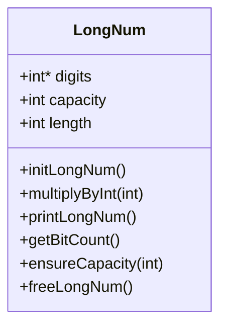
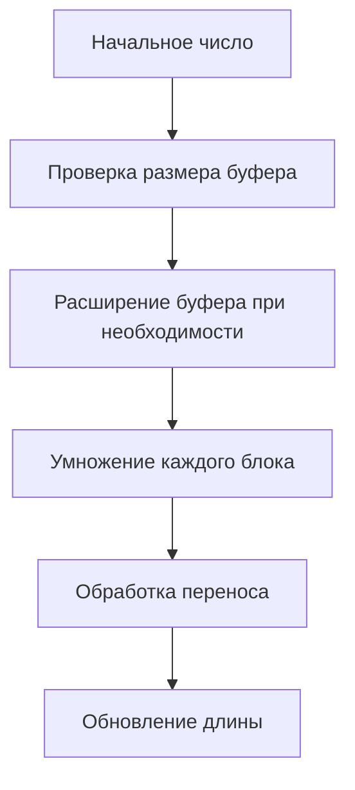

# Длинная арифметика на C



Реализация длинной арифметики для вычисления факториалов больших чисел с визуализацией процесса и отслеживанием памяти.

### Особенности 🚀

- Динамическое выделение памяти
- Визуализация процесса вычисления
- Отслеживание использования памяти
- Поддержка чисел до 10^900000
- Отображение прогресса и важных этапов вычисления

### Структура данных

Большие числа хранятся в структуре:

```c
typedef struct {
    int *digits;     // динамический массив для хранения цифр
    int capacity;    // текущая ёмкость массива
    int length;      // текущая длина числа
} LongNum;
```

Вот схема, как это выглядит в памяти:

```
┌────────────┬────────────┬────────────┬────────┐
│  digits[0] │  digits[1] │  digits[2] │   ...  │
├────────────┼────────────┼────────────┼────────┤
│ 123456789  │ 987654321  │ 246813579  │   ...  │
└────────────┴────────────┴────────────┴────────┘
     ▲            ▲            ▲
  9 цифр       9 цифр      9 цифр
```

Каждая ячейка хранит 9 цифр числа (BASE = 10^9). Это позволяет эффективно использовать память и избежать переполнения при умножении.

### Визуализация структуры данных



### Процесс умножения



## Как использовать

1. Клонируйте репозиторий:
```bash
git clone https://github.com/your-username/long-arithmetic
```

2. Соберите проект:
```bash
make
```

3. Запустите:
```bash
./factorial
```

4. Введите число для подсчета факториала. Программа покажет:
   - Процесс выделения памяти
   - Текущий результат
   - Количество бит в числе
   - Моменты превышения размеров базовых типов данных

## Технические детали 🔧

- BASE = 10^9 (максимальное значение в блоке)
- Динамическое выделение памяти с начальным размером 16 блоков
- Автоматическое удвоение буфера при необходимости
- Отслеживание и вывод информации о выделении памяти

## Визуальные особенности 🎨

- Цветной вывод в терминале
- Прогресс-бар вычисления
- История выделения памяти
- Отметки о преодолении битовых границ

## Ограничения ⚠️

- Только положительные целые числа
- Максимальный множитель: INT_MAX
- Зависит от доступной системной памяти

## Планы на будущее 🎯

- [ ] Оптимизация использования памяти
- [ ] Добавление операций сложения и вычитания
- [ ] Поддержка отрицательных чисел
- [ ] Реализация деления
- [ ] Добавление тестов производительности
